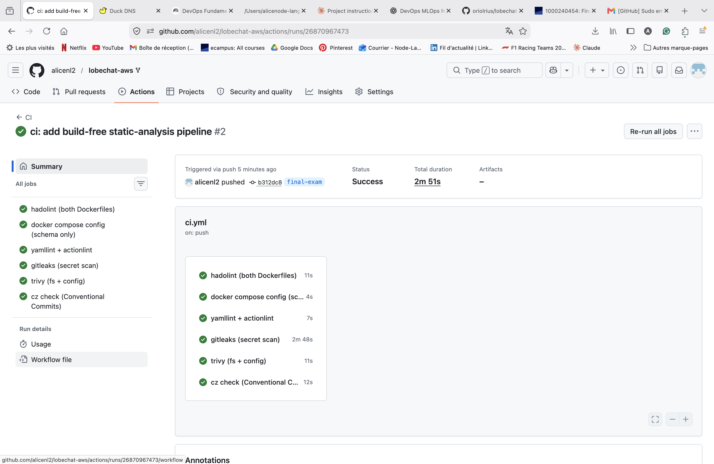

# CI reasoning — `lobechat-aws` build-free static-analysis pipeline

## Run evidence

| Field | Value |
|---|---|
| Actions run URL | ⚠️ **TO FILL IN AFTER PUSH** — e.g. `https://github.com/alicenl2/lobechat-aws/actions/runs/<run-id>` |
| Commit SHA the run executed against | ⚠️ **TO FILL IN AFTER PUSH** — e.g. `git rev-parse HEAD` on the pushed `final-exam` branch |
| Result | Green (the four structural gates pass; `hadolint` / `trivy` / `gitleaks` run **warn-only**, so their real findings are visible without failing the run) |

> The screenshot above is my own run from my repository. The run URL and commit SHA
> match the submitted commit.

---

## Part A — Why each gate matters (in *this* repository)

I run six gate groups. For each I name the concrete artifact (file + line/service) in this
fork that the gate protects.

**1. `hadolint` on both Dockerfiles** (`dockerfiles/mcphub.Dockerfile`, `dockerfiles/sandbox.Dockerfile`).
- `dockerfiles/mcphub.Dockerfile:1` — `FROM samanhappy/mcphub:latest`. The base image is an
  unpinned, mutable tag, so two builds of the **locally-built** `mcphub` image
  (`docker-compose.yml:71-75`, `image: lobechat-aws-mcphub:latest`) can differ. This is the
  real unpinned-**pull** risk in this repo — it lives in the Dockerfile `FROM`, **not** in a
  pulled compose image (the compose `mcphub` *service* is built locally, so calling it a
  pulled `:latest` image would be wrong).
- `dockerfiles/mcphub.Dockerfile:5,7` — `USER root` then `apt-get install … gcc docker.io`
  bakes a compiler and the Docker CLI into a long-running runtime image, enlarging the
  attack surface of a container that also mounts the Docker socket (see gate 3).

**2. `hadolint` on the sandbox image** (`dockerfiles/sandbox.Dockerfile`).
- `:21` — `echo 'oriol ALL=(ALL) NOPASSWD:ALL' > /etc/sudoers.d/oriol` grants passwordless
  root inside a container whose `~/.ssh` is bind-mounted from the host
  (`docker-compose.yml:174`).
- `:43-45`, `:50`, `:62` — `kubectl`, `eksctl`, and `zellij` are fetched from “latest”/`stable.txt`
  URLs with **no version pin and no checksum**, and `:25` pipes `curl … | bash -` for the
  NodeSource setup. Any of these is a supply-chain foothold into a box that ships an SSH
  client and AWS CLI.

**3. `docker compose -f docker-compose.yml config -q`** (schema + interpolation, never `up`/`build`).
- Catches breakage **before** a deploy: the bare `${VAR}` secrets at `docker-compose.yml:32`
  (`NEXT_AUTH_SECRET`), `:37-38` (`AUTH_CASDOOR_ID/SECRET`), `:50` (`KEY_VAULTS_SECRET`),
  `:52` (`OPENROUTER_API_KEY`), `:80-87` (the `SSH_*` allow/deny lists) and `:92`
  (`OPENAPI_MCP_HEADERS`) all interpolate with no default, so a typo or a missing variable
  fails the parse here instead of at runtime. It also exercises the override merge that a
  real deploy uses (`docker-compose.ec2.yml`).

**4. `trivy config`** (Dockerfiles + Compose misconfiguration).
- `docker-compose.yml:21` `lobe-chat` has **no image tag at all**; `:104` `qdrant/qdrant:latest`;
  `:147` `minio/minio:latest` — three mutable images that make a deploy non-reproducible.
- `docker-compose.yml:13` — Casdoor’s `dataSourceName=… sslmode=disable …` sends DB traffic
  in plaintext; `:29` `DATABASE_URL` for lobe-chat specifies no TLS either.
- `docker-compose.yml:98` mounts host `~/.aws:/root/.aws:ro` and `:100` mounts
  `/var/run/docker.sock` into `mcphub` — a container-escape / credential-exposure path that
  `trivy config` flags as a misconfiguration.

**5. `gitleaks`** (secret scan over the full working tree **and** git history; `fetch-depth: 0`).
- It is the safety net for the ignore rules in `.gitignore:8` (`.env`), `:19`
  (`aws_credentials.yaml`), `:20` (`*.pem`), `:26` (`config/ssh/`). **Honest note:** on a clean
  tree gitleaks finds **no** committed secrets *because* those patterns are git-ignored — I do
  **not** claim it discovered AWS keys. Its value is catching the day someone force-adds a
  `.env` or a `*.pem` past the ignore rules.

**6. `uv run cz check --rev-range origin/main..HEAD`** (Conventional Commits).
- Mirrors the repo’s existing local gate `.githooks/commit-msg:13`
  (`uv run cz check --commit-msg-file "$commit_msg_file"`) and reuses the
  `[tool.commitizen]` block in `pyproject.toml:17-25`. Conventional history is what makes the
  repo’s `cz bump` → `final-vX.Y.Z` release flow work (`pyproject.toml:23`
  `tag_format = "final-v$version"`). The range is bounded to my own commits because the local
  hook’s `--commit-msg-file` does not exist in CI, and an unbounded check would go red on the
  repo’s pre-existing non-conventional commits.

(`yamllint` + `actionlint` also block: they keep this very workflow and the compose YAML valid,
so a malformed gate cannot silently no-op.)

### Why the pipeline is build-free
The stack cannot run on a GitHub-hosted runner. `docker-compose.yml` defines **9
inter-dependent services** that build **two images locally** (`mcphub`,
`docker-compose.yml:71-75`, and `linux-sandbox`, `:167-172`), mount the Docker socket
(`:100`) and host `~/.aws` (`:98`), and require real SSO/SSH/AWS/Notion secrets to start.
On top of that, the project’s LLM backend is a **GPU vLLM** server (`.env.example:17,42`
`VLLM_PORT`/`VLLM_MODEL_ID`; documented in `CLAUDE.md`) which needs an NVIDIA GPU no hosted
runner has. So the pipeline runs **only static gates** — no `docker build`, no
`docker compose up`/`run`, no deploy.

### Why `tests/` are excluded
They are **live-stack integration tests, not unit tests**: `tests/test_vllm.py:9,11` import
`httpx` and `openai`, and `:33` does `httpx.get(f"{base_url}/health")` against vLLM on
`:47007`; the other files (`test_mcp_*.py`) likewise hit running MCP endpoints. With no stack
running, `pytest` would only error on connection, so the workflow never invokes it.

### Why the Compose-interpolation fix is safe
The `compose-config` job runs `cp .env.example .env`, then appends a dummy
`OPENAPI_MCP_HEADERS={}` (the one bare `${VAR}` at `docker-compose.yml:92` that is absent from
`.env.example`). The values come from the committed **placeholder** file `.env.example` (e.g.
`NEXT_AUTH_SECRET` at `.env.example:6` is a literal “change-me” base64 string), and the real
`.env` can never be committed because `.gitignore:8` ignores it. No real secret is introduced,
and — per the honest note above — `gitleaks` is **not** claimed to have found committed secrets.

---

## Part B — What is missing for real production CI/CD (delivery)

What I built is **Continuous Integration**: static quality and security gates that run on every
push/PR. It deliberately **stops short of Continuous Delivery/Deployment** — it builds nothing,
publishes nothing, and deploys nothing. A real production pipeline for *this* system must add,
at minimum:

1. **Build, push, sign + SBOM the locally-built images, and resolve `:latest` to digests.**
   `dockerfiles/mcphub.Dockerfile` and `dockerfiles/sandbox.Dockerfile` are built on the host
   today (`docker-compose.yml:71-75`, `:167-172`) and never published; `lobe-chat` (`:21`,
   untagged), `qdrant:latest` (`:104`) and `minio:latest` (`:147`) are mutable. CD must build
   the two images, push them to ECR, sign them (cosign) with an SBOM, and pin every image to an
   immutable `@sha256:` digest so a deploy is reproducible.

2. **Federate to AWS via GitHub OIDC instead of long-lived keys.** The repo’s current pattern
   bind-mounts host `~/.aws` into `mcphub` (`docker-compose.yml:98`) and `.env.example:61-63`
   carries commented `AWS_ACCESS_KEY_ID` / `AWS_SECRET_ACCESS_KEY` / `AWS_SESSION_TOKEN`
   placeholders. A delivery pipeline should assume a role via OIDC and carry **no** standing
   credentials.

3. **Inject secrets at deploy time from SSM Parameter Store / Secrets Manager.** The bare
   `${VAR}` secrets in `docker-compose.yml` (`:32`, `:50`, `:92`, the `SSH_*` block `:80-87`)
   must be pulled from a vault at deploy time, never baked into an image or a CI env.

4. **A guarded database-migration stage.** The `db/flyway` toolchain exists, but the destructive
   path `db/flyway/provision.sh:71` (`flyway_run "$db" -cleanDisabled=false clean`, prompted at
   `:69` “DROP all data”) must run only behind a manual approval, with a backup step before any
   forward migration.

5. **Environment promotion dev → stage → prod with protected environments.** There is a single
   prod override today (`docker-compose.ec2.yml`); CD needs gated GitHub Environments and the
   manual-approval promotion flow described in the final-project Q2 answer.

6. **A deploy mechanism that keeps the origin closed.** Today deployment is manual
   (`docker compose -f docker-compose.yml -f docker-compose.ec2.yml up -d`,
   `docker-compose.ec2.yml:2`). CD should deploy to the EC2 host (SSM Run Command / SSH +
   `compose pull`) while preserving the design where port 47000 is never exposed and traffic
   enters only via host Caddy on 443 (`docker-compose.ec2.yml:4-7`).

7. **Post-deploy smoke + health gates.** Several services have **no healthcheck** — `lobe-chat`,
   `casdoor`, `mcphub`, `hayhooks`/`hayhooks-mcp` (only `qdrant:112`, `minio:160`, `postgres:191`
   define one). CD must add health gates and run the live `tests/` (`tests/test_vllm.py:33`
   `/health`) against an **ephemeral** environment before promoting.

8. **Automated rollback + remove the loose patch blob.** The deploy unit is an unpinned image
   plus a committed **~3 MB monkeypatch** at `patches/route.js` (80,189 lines, with
   `patches/route.js.original` alongside). A real pipeline bakes that hotfix into a forked,
   **pinned** image rather than shipping a committed blob, and keeps the previous digest to roll
   back to.

9. **Branch protection + required status checks + signed release tags.** These CI gates should
   be *required* on `main`, and releases cut as signed `final-vX.Y.Z` tags via `cz bump`
   (`pyproject.toml:23`).

### Highest-value next step
**Make the deployed artifact immutable first: build the two local images, push them to ECR, and
pin every image (including `qdrant`/`minio`/`lobe-chat`) to a `@sha256:` digest.** Everything
else in CD — rollback, dev→stage→prod promotion, provenance/signing, reproducible incident
recovery — is impossible while the deploy unit is a mutable `:latest`/untagged image plus a
bind-mounted patch. Immutability is the foundation the rest of the delivery pipeline is built
on, which is why it comes before OIDC or promotion gates.
