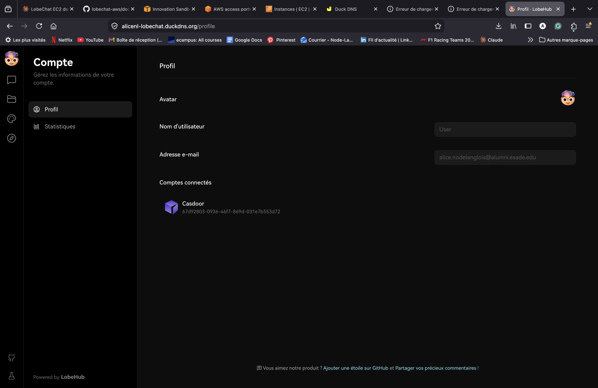
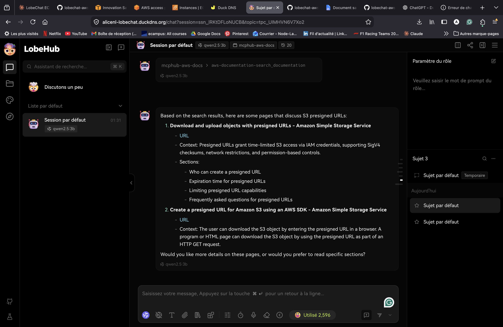

# Final Project — Evidence Report

## 1. Identity

| Field | Value |
|---|---|
| Student name | Alice Node-Langlois |
| ESADE email | alice.nodelanglois@alumni.esade.edu |
| GitHub repo URL | https://github.com/alicenl2/lobechat-aws (must be **private**; user `joseporiolrius` invited as collaborator) |
| Latest commit SHA | the `bump: 0.7.0 → 0.8.0` commit tagged `final-v0.8.0` (run `git rev-parse final-v0.8.0`) |
| Final tag | final-v0.8.0 |

## 2. Public URL

<!-- Grader clicks. If down or HTTP, practical = 0. -->

**[https://alicenl-lobechat.duckdns.org](https://alicenl-lobechat.duckdns.org)**

## 3. Screenshot — LobeChat over HTTPS, logged in

<!--
  Frame must show:
    - browser address bar with padlock + the public HTTPS URL
    - LobeChat home page after Casdoor login
    - your ESADE email visible (browser profile, account menu, or terminal
      next to the browser with the prompt)
  Commit as: lobechat-https.png
-->



## 4. Screenshot — chat working (streaming + MCP)

<!--
  One frame showing:
    - a chat reply that streamed (any model)
    - one MCP tool call result rendered in the same chat
  Commit as: chat-mcp.png
-->



## 5. Public reachability — `curl -sI https://<host>/`

<!--
  Run from OUTSIDE the EC2 (your laptop). Paste full output.
  Expected: HTTP/2 200 or 302, valid TLS, Set-Cookie with Secure flag if
  Casdoor session was hit.
-->

```
$ curl -sI https://alicenl-lobechat.duckdns.org/      # 2026-06-01T20:38:59Z, from laptop
HTTP/2 307
alt-svc: h3=":443"; ma=2592000
date: Mon, 01 Jun 2026 20:39:00 GMT
location: /chat
via: 1.1 Caddy
```
HTTP/2 over a valid Let's Encrypt/ZeroSSL cert, served via Caddy, redirecting to `/chat`.

## 6. Negative test — port 47000 closed

<!--
  Run from OUTSIDE the EC2 against the EIP. Paste full output.
  Expected: connection refused or timed out.
-->

```
$ curl -v --max-time 6 http://52.31.85.106:47000/    # 2026-06-01, from laptop (EIP)
*   Trying 52.31.85.106:47000...
* Connection timed out after 6002 milliseconds
* closing connection #0
curl: (28) Connection timed out after 6002 milliseconds
```
Port 47000 is not in the security group (only 22/80/443), so the LobeChat
origin is unreachable directly — it is served only through Caddy on 443.

## 7. Stack runtime — `docker compose ps`

<!--
  Run on the EC2. Paste full output.
  All required services must show Up (healthy where applicable):
  lobe-chat, casdoor, postgres, minio, qdrant, mcphub, plus your reverse proxy.
-->

```
$ docker compose -f docker-compose.yml -f docker-compose.ec2.yml ps   # on EC2, 2026-06-01
NAME              STATUS
casdoor           Up 5 minutes
hayhooks          Up 5 minutes
hayhooks-mcp      Up 5 minutes
lobe-chat         Up 5 minutes
mcphub            Up 6 minutes
minio             Up 6 minutes (healthy)
qdrant            Up 6 minutes (healthy)
shared-postgres   Up 6 minutes (healthy)
```
Reverse proxy is host-level Caddy (`systemctl is-active caddy` → `active`),
terminating TLS for all three DuckDNS hostnames on 443. vLLM is intentionally
absent (no GPU; LobeChat uses OpenRouter as the LLM backend).
