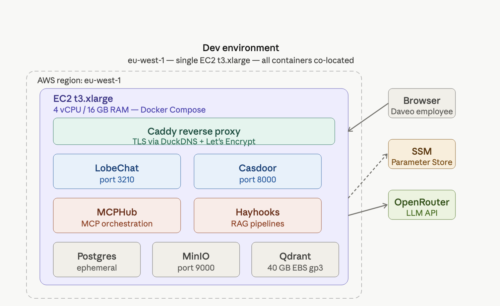
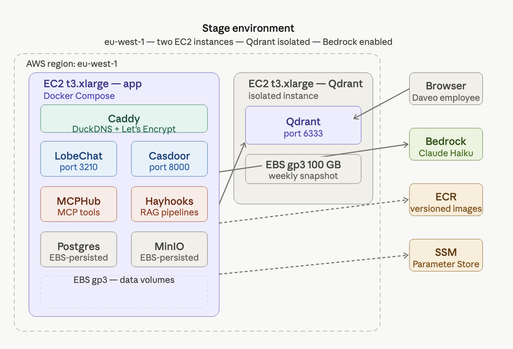
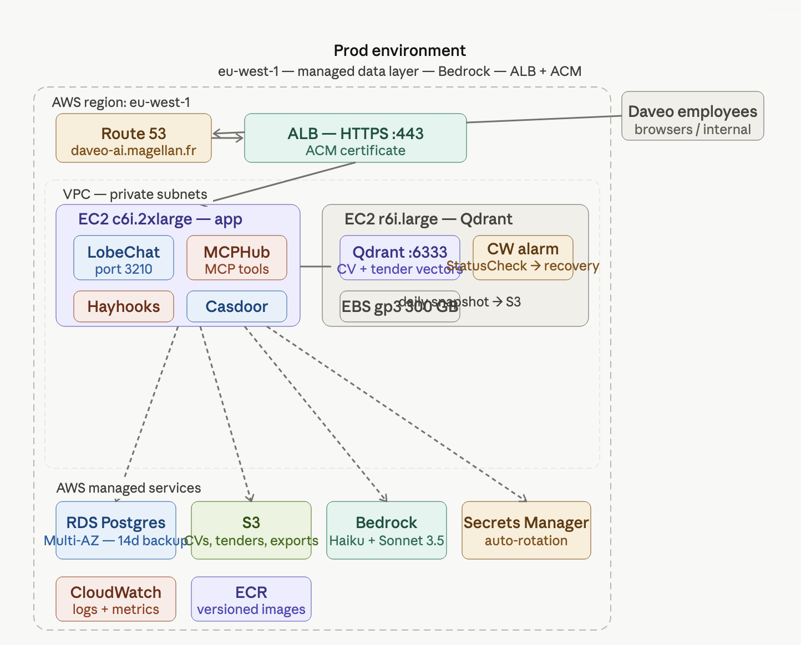

# Q2 — 3-environment architecture evolution

## Per-environment component table

| Component | Dev | Stage | Prod |
|---|---|---|---|
| LobeChat | Docker container on `t3.xlarge` (1 instance) | Docker container on `t3.xlarge` (1 instance) | Docker containers behind ALB, `c6i.2xlarge` |
| Casdoor | Docker container, same EC2 as LobeChat | Docker container, same EC2 as LobeChat | Docker container on dedicated `t3.medium`, backed by RDS |
| Postgres | Docker container, ephemeral, same EC2 | Docker container with persisted EBS volume | AWS RDS PostgreSQL Multi-AZ, `db.t3.medium` |
| MinIO | Docker container on EC2, local EBS | Docker container on EC2, 100 GB EBS | Replaced by AWS S3 — MinIO removed entirely |
| Qdrant | `t3.xlarge` EC2, 40 GB gp3 EBS | `t3.xlarge` EC2, 100 GB gp3 EBS | `r6i.large` EC2, 300 GB gp3 EBS |
| MCPHub | Docker container, same EC2 | Docker container, same EC2 | Docker container, dedicated `t3.medium` |
| Hayhooks | Docker container, same EC2 | Docker container, same EC2 | Docker container, `c6i.xlarge` for CPU-heavy inference |
| LLM Provider | OpenRouter API, pay-per-use, no infrastructure | OpenRouter or AWS Bedrock, Claude Haiku | AWS Bedrock, Claude Sonnet 3.5 for drafting and Haiku for extraction |

## Qdrant on EC2 — sizing, snapshots, recovery

### EBS sizing

| Env | Vectors estimated | EBS size | Type |
|---|---:|---|---|
| Dev | ~50K sample CVs + test tenders | 40 GB gp3 | Development/testing |
| Stage | ~200K anonymized prod-like dataset | 100 GB gp3 | Pre-prod validation |
| Prod | ~1M+ all CVs, proposals, client docs, 3 years | 300 GB gp3 | Production |

### Sizing logic

One embedding of around 1,536 dimensions stored as `float32` represents approximately 6 KB of raw vector data. Qdrant also needs additional storage for the HNSW index, metadata and payloads, so I apply an overhead of around 3× to 4×.

At around 1 million vectors, the raw vector storage would be approximately 6 GB. With index overhead, this becomes around 24 GB. Therefore, 300 GB gp3 EBS in production gives enough room for future growth, multiple collections such as CVs, proposals and ESG documents, and temporary local snapshots before they are pushed to S3.

### Why gp3 instead of gp2

I would use gp3 instead of gp2 because gp3 provides a baseline of 3,000 IOPS at a lower and more predictable cost. This matters for Qdrant because the workload is read-heavy during CV matching and tender search. When a business manager asks the assistant to find the best consultant profiles, Qdrant needs fast vector search performance.

### Snapshot policy

| Env | Snapshot policy |
|---|---|
| Dev | No automated snapshots. The data is disposable and can be recreated from sample CVs and test tenders. |
| Stage | Weekly Qdrant snapshots using Qdrant's built-in `/collections/{name}/snapshots` API, triggered by a cron job or systemd timer, then uploaded to S3 using the AWS CLI. |
| Prod | Daily Qdrant snapshots using Qdrant's built-in snapshot API, triggered by a cron job or systemd timer, then uploaded to S3 using the AWS CLI with a 7-day retention policy. |

In production, AWS Backup would also take daily EBS snapshots for full-volume recovery. This is separate from Qdrant-level snapshots. The Qdrant snapshot is useful for restoring a collection, while the EBS snapshot is useful for restoring the full EC2 storage volume.

### Instance recovery

In production, a CloudWatch alarm would monitor `StatusCheckFailed_System`. If the EC2 instance has a hardware or host-level failure, the alarm triggers the EC2 instance recovery action. This preserves the Elastic IP and keeps the EBS volume attached.

If automatic recovery fails, the recovery process is:

1. Launch a replacement EC2 instance from the latest AMI.
2. Re-attach the EBS volume containing the Qdrant data directory.
3. Restart the Qdrant Docker container or system service.
4. Validate that the collections are available.
5. Reconnect LobeChat/MCPHub to the Qdrant endpoint.

Because Qdrant data lives on EBS and not on instance storage, the data remains intact if the EC2 host fails. This provides near-zero data loss for hardware failure scenarios, with an estimated recovery time objective of around 5–10 minutes.

### Why self-hosted Qdrant is acceptable for Daveo

Self-hosting Qdrant on EC2 is acceptable for Daveo because the vector database contains embeddings of sensitive internal content such as consultant CVs, client tenders, previous proposals and internal company documents. Even if embeddings are not the original documents, they still represent semantic information about confidential data. Storing them in an external managed vector database such as Pinecone or Weaviate Cloud would mean moving this sensitive vector data outside Daveo's controlled AWS infrastructure.

At Daveo's expected scale, a managed vector database is also not strictly necessary. The use case is around internal tender response, CV matching and document search, with an estimated production volume of around 1 million vectors. A single self-hosted Qdrant instance on an `r6i.large` EC2 instance with gp3 EBS is enough for this workload. It is cheaper, gives more control over data location, and satisfies the assignment constraint that Qdrant must run on EC2 in all three environments.

Operationally, Qdrant is simple enough for this scale. It can run as a Docker container, stores its data on EBS, supports built-in snapshots, and does not require a complex cluster for Daveo's internal usage.

## AWS managed services in prod

| Service | Role in the Daveo architecture |
|---|---|
| AWS RDS PostgreSQL | Stores Casdoor identity data, including employee accounts, roles and access levels, as well as LobeChat conversation metadata. Multi-AZ ensures availability if one AZ fails, which matters because Daveo cannot afford login outages during a tender deadline. |
| AWS S3 | Replaces MinIO in production. Stores uploaded tender PDFs, client documents, exported proposals in Word/PDF/Excel format, and Qdrant snapshots. Versioning is enabled so a deleted tender document can be recovered. |
| AWS Bedrock | Provides LLM inference for the Tender Response Assistant. Claude Haiku is used for document extraction because it is fast and cheaper, while Claude Sonnet is used for proposal drafting because it provides higher-quality writing. Data is processed within AWS `eu-west-1` through a VPC endpoint, so no data leaves the region. |
| ALB Application Load Balancer | Terminates HTTPS with an ACM certificate and routes traffic to LobeChat containers. It provides a single stable DNS entry for employees even if containers restart. It also ensures that the internal LobeChat port, such as `3210`, is never exposed directly to the public internet. |
| AWS Secrets Manager | Stores all secrets, including the Casdoor client secret, Postgres credentials, Bedrock API keys, MinIO access keys in dev/stage, and S3 bucket credentials. Secrets are referenced in CloudFormation and injected at runtime, so no `.env` files are committed to Git. |
| CloudWatch | Centralizes logs from all containers through the CloudWatch agent, EC2 metrics, Qdrant `StatusCheckFailed` alarms, and cost anomaly detection alerts. Daveo’s operations team gets a single place to monitor platform health without running its own logging stack. |

## Promotion flow

### Branching strategy

| Branch / tag | Target environment | Deployment behavior |
|---|---|---|
| `main` | Dev | Always deployable to dev, auto-deploys on push |
| `release/x.y` | Stage | Auto-deploys on merge into the release branch |
| `vX.Y.Z` tags | Prod | Requires a manual approval gate before production deployment |

### Pull requests

All changes go through pull requests. Direct pushes to `main` are not allowed.

Each pull request requires:

- 1 reviewer approval;
- passing CI checks before merge;
- conventional commits enforced through `commitlint`, such as `feat:`, `fix:` and `chore:`.

This commit format supports semantic versioning and makes releases easier to track.

### CI/CD with GitHub Actions

| Trigger | Pipeline behavior |
|---|---|
| Pull request | Runs linting, unit tests and Docker build validation, but does not push images |
| Merge to `main` | Builds Docker images, pushes them to ECR with a `sha-{commit}` tag, deploys CloudFormation to dev, then runs smoke tests |
| Merge to `release/*` | Runs the same pipeline but targets the stage environment |
| Tag `v*` | Starts the production pipeline, but requires manual approval in GitHub Actions before deploying to prod |

Smoke tests include:

- LobeChat health check;
- Casdoor login endpoint check.

### Docker image builds

All custom images, including Hayhooks and MCPHub configuration images, are built and pushed to AWS ECR.

| Environment | Image tag strategy |
|---|---|
| Dev | Can use `latest` for speed |
| Stage | Uses fixed semantic version tags, such as `v1.4.2` |
| Prod | Uses fixed semantic version tags, such as `v1.4.2` |

In stage and prod, `latest` is never used because deployments must be reproducible.

### Infrastructure-as-code

CloudFormation templates are used for each environment and are parameterized with values such as:

```bash
--parameter-overrides Env=prod
```

## Data strategy

### Dev

- Use a synthetic dataset: 20 fake consultant CVs (generated with Claude, no real employee data), and 5 anonymized tender documents (real structure, fake company names and financials).
- Postgres seeded with a `seed.sql` script in the repo — consistent, reproducible, shareable with the team.
- Qdrant populated by running the embedding pipeline against the synthetic dataset on first boot.
- No real client data ever enters dev — Daveo's NDAs explicitly prohibit this.

### Stage

- Weekly automated RDS snapshot restore from prod, scrubbed via a Python anonymization script (replaces real names with `Consultant_XXX`, client names with `Client_XXX`, financial figures randomized ±20%).
- Qdrant: restore from the most recent prod S3 snapshot, then re-index — ensures stage vector search behaves identically to prod.
- S3 bucket in stage: sync from the prod bucket with a lifecycle rule that strips metadata fields tagged `pii:true`.
- Goal: stage should catch any performance regression in CV matching or proposal generation before prod.

### Production

- RDS: automated daily backups with 14-day retention; manual snapshot before any schema migration.
- S3: versioning enabled on all buckets; lifecycle rule moves objects older than 90 days to S3 Glacier Instant Retrieval (cost reduction, GDPR-compliant retention).
- Qdrant: daily snapshot via cron → uploaded to a dedicated S3 bucket → 7-day retention; the EBS volume is also snapshotted daily via AWS Backup.
- Recovery test: monthly restore drill in stage to validate RTO — "a backup that has never been tested is not a backup".

## Trade-off table

| Environment | Reliability | Cost efficiency | Operational complexity |
|---|---:|---:|---:|
| Dev | ★★☆☆☆ (2/5) | ★★★★★ (5/5) | ★★☆☆☆ (2/5) |
| Stage | ★★★☆☆ (3/5) | ★★★☆☆ (3/5) | ★★★☆☆ (3/5) |
| Prod | ★★★★★ (5/5) | ★★☆☆☆ (2/5) | ★★★★☆ (4/5) |

In this trade-off matrix, dev is low on reliability: it runs a single EC2 instance with no backups and is disposable. A dev instance going down costs about 10 minutes to rebuild, not a business incident. However, it scores maximum on cost efficiency because everything runs on one `t3.xlarge` (~$120/mo), with no RDS, no ALB and no redundancy. Stage sits in the middle: it must be reliable enough to run realistic tests, but it does not need Multi-AZ RDS or multi-container LobeChat. Finally, production scores low on cost efficiency, because you are paying for redundancy, managed services and Bedrock token costs at scale — but that is the right trade-off for a tool handling NDA-bound client documents. It is also more operationally complex than the earlier stages, because CloudWatch dashboards, Secrets Manager rotation, RDS maintenance windows and Qdrant snapshot monitoring all need someone to own them. In Daveo's case, that owner is the DevOps / platform team.

## Reverse-proxy / TLS choice

We use Caddy in both dev and stage because it's free and zero-maintenance for a single instance. Then ALB and ACM in prod, since once LobeChat scales to multiple containers behind a load balancer you need managed TLS, health checks and Route 53 integration that a single Caddy box can't give you.

## Architecture diagrams






